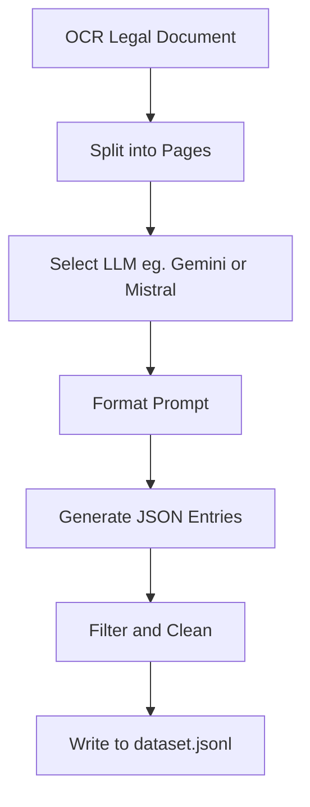

# Synthetic Data Generation for LLM Training

## 🧠 Approach

In order to more organically make my thinking available, I decided to maintain
a development log throughout the process. I have used that as a basis for this
document. The log is provided as the last segment in this document as well, if
it's needed.

The goal was to generate synthetic training data to teach an LLM to identify
which tools to invoke (e.g., full-text or vector search) when responding to
legal queries. The model is not responsible for answering the queries — only
for selecting the right tools based on query intent.

Given a 400+ page OCR-transcribed legal document, my approach was to:

1. Split the document by page using structured markers (e.g. `=== PAGE N ===`).
2. Iterate over each page, optionally filtering out pages without meaningful legal content.
3. Use a Large Language Model (LLM) to generate synthetic queries and corresponding tool-use JSON objects based on the content of each page.
4. Aggregate results into a `.jsonl` file for use in supervised fine-tuning (SFT).

Two modes of generation were implemented:

- **API-based** using Google Gemini.
- **Local inference** using the `Mistral-7B-Instruct-v0.3` model from Hugging Face.

_Note: the local approach has not been fully tested due to the large download
time of the model. I have attempted to include the code and believe there
should not be major issues running it but decided to try and focus on writing
up my ideas as a priority._

---

## Key Design Decisions & Assumptions

### Use LLMs instead of Traditional NLP

I initially considered using templates and keyword-based generation with traditional NLP tools, but found that:

- Coverage and diversity were low.
- Time constraints and unfamiliarity with text parsing at scale made this infeasible.

Instead, I adopted an LLM-centric pipeline — a common technique found in recent
research — which allowed for semantically rich, diverse examples. The research
I went through is linked below.

- [Quality Matters: Evaluating Synthetic Data for Tool-Using LLMs](https://arxiv.org/pdf/2409.16341)
- [ToolAlpaca: Generalized Tool Learning for Language Models with 3000 Simulated Cases](https://arxiv.org/pdf/2306.05301)

I also found a paper that introduced a knowledge graph-based data generation
framework, [GraphGen](https://arxiv.org/pdf/2505.20416), that seemed promising on large stores of documents, but decided not to
try and implement due to time constraints.

---

### Page-wise Chunking

Because the OCR document is large, I structured processing around individual
pages. Each LLM call is limited to a single page's worth of content, ensuring:

- Reduced prompt size.
- Better grounding.
- Easy attribution of queries to document locations.

---

### Chat-style Context Handling

For Gemini, I primed the model once with a detailed system prompt, then
streamed document pages incrementally through the chat interface. This
preserved instruction context without resending the full prompt each time.

To replicate this for local inference with Mistral, I:

- Used a chat-style formatting convention (`[INST]`, `<<SYS>>`) in prompts.
- Simulated chat history manually by combining the system instruction and user input.

---

### Output Structure & Filtering

Each row of generated data includes:

- A realistic legal query.
- One or more tool invocations (`full_text_search`, `vector_search`).
- The source page number.

The LLM was explicitly instructed to **generate nothing** if a page lacked useful content. This reduces noise and improves data quality.

---

## How to Run the Script

This project requires **Python 3.12** and uses a `venv` environment. Follow the steps below to set everything up and run the data generation pipeline.

### 1. Clone the repository and set up the environment

```bash
python3.12 -m venv venv
source venv/bin/activate
pip install -r requirements.txt
```

### 2. Add your API key for Google Gemini

Create a `.env` file in the project root with the following contents.

```ini
GEMINI_API_KEY=your-google-gemini-api-key-here
```

This is required for the Gemini class to authenticate and call the API.

3. Run the generation pipeline

Once setup is complete, you can run the main script to generate the synthetic dataset:

```bash
python src/main.py
```

The final dataset will be saved to `data/dataset.jsonl`.

---

## Pipeline Diagram



## Dev Log

### Initial Plan

Given 400 something pages, simplify approach to one entry per page

1. For each page, look for full text or vector search keywords
2. Choose one of the found ones (or skip current page if none found)
3. Use one of the templates to insert text based on the keyword found
4. Might have to look into some traditional NLP to accomplish this

### Second Plan

After doing some research, it became clear that plain manipulation of text with
traditional NLP would not be possible in the given time frame, possibly because
of my lack of experience in this area.

Through the handful of research papers I glossed over, using an LLM for
synthetic dataset generation seemed like a surprisingly common method and
having worked with LLMs before, I believe this will work better than the last
strategy could.

I plan to implement both local and api-based models, probably one each. The
most crucial part of this approach is probably handling the prompt, and
ensuring accurate data. The first one is pretty straightforward, I just have to
be careful with how I structure the prompt. For the second, I want to give the
LLM the option to not generate data if it didn't find it (assuming I give small
chunks of the corpora), and also ask it to validate the accuracy of what it
generated post-hoc. The second one might be out of scope if I run out of time.

I decided to make two classes, one for running Gemini through its API and
another to run inference locally. Before I implement local inference, I'd like
to run through Gemini to validate feasibility and then extend using local
inference. The next step in the process is probably to write the actual prompt,
then split the ocr text by pages so that I can generate in batches to retain
context properly, and finally bring everything together into a pipeline and
generate data. Some helper functions may be required along the way, and I'll
try to keep everything fairly extensible.

I tested an arbitrary prompt with gemini and generation is working as expected.
I also decided to use ai to help me write some regex that would parse a
response output into a json object. The output is expected to be a list of
objects, each following the dataset row format provided. Next, I'm planning to
implement a simple function that splits the ocr document by the page numbers.
Finally, I'll write a function that reads the ocr document, splits it, and then
iteratively provides each page to gemini. It will then take all of that output
and write it to a .jsonl file. Since we already have the pages, I plan to add
the page number to each row of the dataset. Might help with SFT.

I encountered resource limits while working with the Gemini API and was able to
limit the input to only 10 pages to get around it for now. I expect this to not
cause any issues later but will consume some credits to confirm when
everything's done. For now, I'll move onto local inference.

Through a quick google search, I decided to use Mistral 7B v0.3 model to make
another class similar to the one with Gemini. Since I'll be using huggingface
for this, it should be easy to just replace the model name string to change the
model used. Huggingface page for mistral's model revealed that there's a
specific instruction format required. I took help from AI to write a function
that lets me format chat messages as required.
